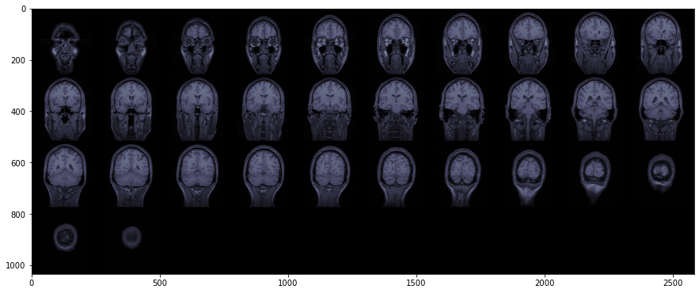
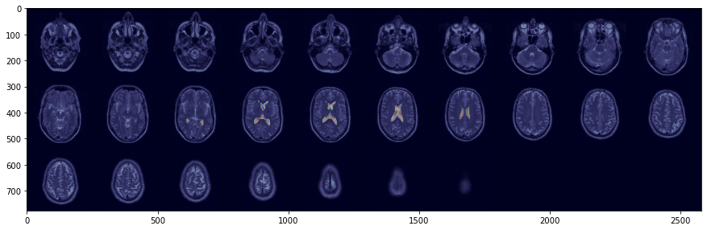
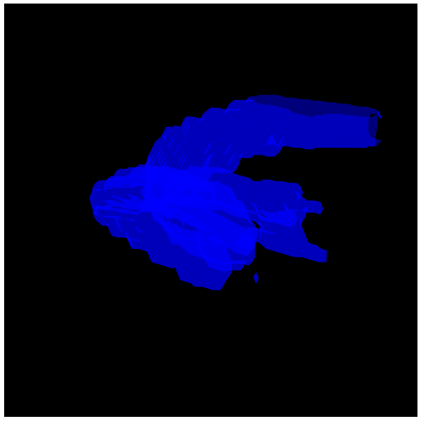
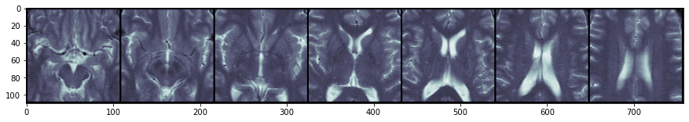
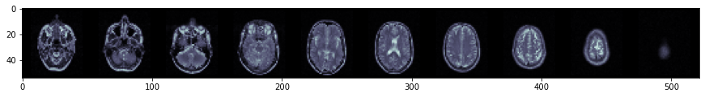
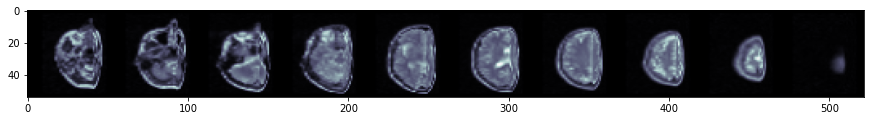
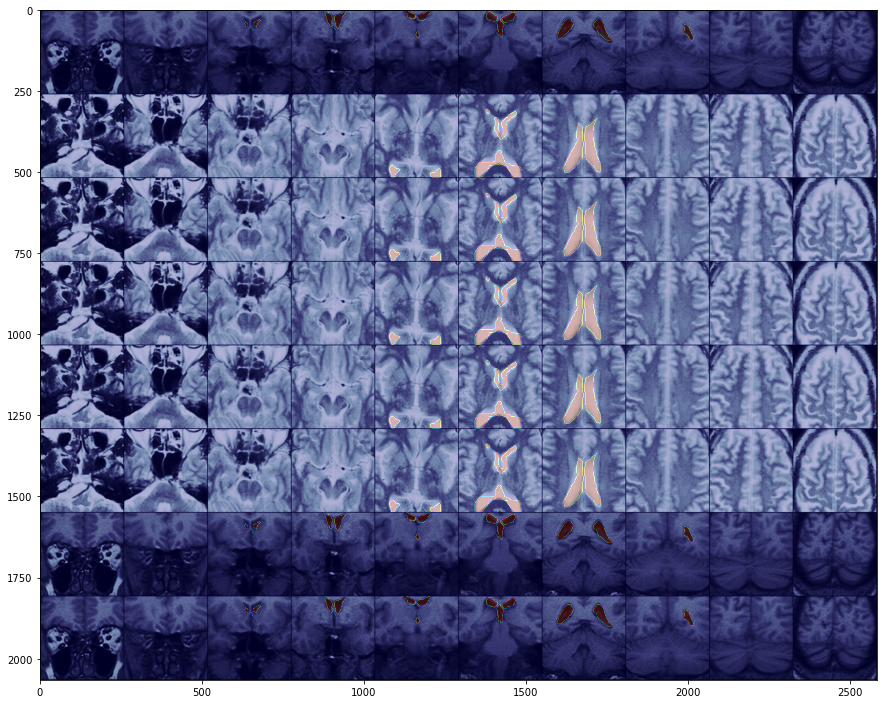

# FAIMED 3D
> fastai extension for medical 3d images including 3d transforms, datablocks and novel network architectures. 


## Install

`pip install faimed3d`

## How to use

In contrast to fastai, which uses Pydicom to read medical images, faimed3d uses SimpleITK, as it supports more image formats.  
Currently faimed3d is build using the following versions of fastai, pytorch and SimpleITK

| SimpleITK           |  torch   | fastai |
|---------------------|----------|--------|
| 2.0.0rc3 (ITK 5.1)  |  1.7.0   | 2.1.5  |


### Loading 3d images

Faimed3d uses SimpleITK to load files, thus 3D-DICOM files, DICOM series, NIfTI, NRRD, ... are supported. Files can be loaded either as TensorDicom3D or TensorMask3D. 

```python
# The sample images are taken from Zenodo (10.5281/zenodo.16956)
t2_ax = TensorDicom3D.create('../samples/t2w_tse/')
t1_cor = TensorDicom3D.create('../samples/t1w_ffe/')

t2_mask = TensorMask3D.create('../samples/masks/t2_mask.nii.gz')
t1_mask = TensorMask3D.create('../samples/masks/t1_mask.nii.gz')
```

3D Images can be displayed as a series of 2D slices in axial, sagittal or coronal reconstruction. 

```python
t1_cor.show()
```





Masks can be overlaid to the original image. 

```python
t2_ax.show()
t2_mask.show(add_to_existing=True, alpha = 0.25, cmap = 'jet')
```





Masks can also be renderd in 3D for better visualization (experimental stage). 

```python
t1_mask.render_3d()
```

    ../faimed3d/basics.py:465: FutureWarning: marching_cubes_lewiner is deprecated in favor of marching_cubes. marching_cubes_lewiner will be removed in version 0.19
      verts, faces, normals, values = marching_cubes_lewiner(im.permute(1, 2, 0).numpy())





### Transform 3d images
Faimed3d allows for most transforms of fastai to be applied to the 3d images. 

```python
t2_cropped = RandomCrop3D((10,75,75), (0,0,0), False)(t2_ax)
t2_cropped.show()
```





```python
t2_resized = Resize3D((10, 50, 50))(t2_ax)
t2_resized.show()
```





```python
RandomWarp3D(p=1, max_magnitude=0.3)(t2_resized, split_idx=0).show()
```





### Train 3d Model

```python
mris = DataBlock(
    blocks = (ImageBlock3D(cls=TensorDicom3D), 
              MaskBlock3D(cls=TensorMask3D)),
    get_x = lambda x: x[0],
    get_y = lambda x: x[1], 
    item_tfms = ResizeCrop3D(crop_by = (5, 75, 75), resize_to = (10, 256, 256)),
    batch_tfms = [
        *aug_transforms_3d(), 
        PseudoColor])
```

```python
d = pd.DataFrame({'dcm':['../samples/t1w_ffe/', '../samples/t2w_tse/']*20, 
                  'mask':['../samples/masks/t1_mask.nii.gz', '../samples/masks/t2_mask.nii.gz']*20,})
```

```python
dls = mris.dataloaders(d, 
                      batch_size = 8, 
                      num_workers=0)
```

```python
show_batch_3d(dls, with_mask=True)
```

    ../faimed3d/basics.py:61: UserWarning: Object is not a rank 3 tensor but a rank 4 tensor. Assuming the 1st dimension is a (fake) color channel it will be removed
      warn(w)





```python
learn = Learner(dls, 
                DeepLab(num_classes = 2, n_channels=1),
                opt_func = SGD, 
                loss_func = MCCLossMulti(2))
learn = learn.to_fp16()
```

```python
# slow
learn.fit_one_cycle(5, 0.1)
```


<table border="1" class="dataframe">
  <thead>
    <tr style="text-align: left;">
      <th>epoch</th>
      <th>train_loss</th>
      <th>valid_loss</th>
      <th>time</th>
    </tr>
  </thead>
  <tbody>
    <tr>
      <td>0</td>
      <td>0.993857</td>
      <td>0.998962</td>
      <td>00:12</td>
    </tr>
    <tr>
      <td>1</td>
      <td>0.993949</td>
      <td>0.998909</td>
      <td>00:07</td>
    </tr>
    <tr>
      <td>2</td>
      <td>0.993110</td>
      <td>0.994354</td>
      <td>00:07</td>
    </tr>
    <tr>
      <td>3</td>
      <td>0.992251</td>
      <td>0.996972</td>
      <td>00:07</td>
    </tr>
    <tr>
      <td>4</td>
      <td>0.988365</td>
      <td>0.997775</td>
      <td>00:07</td>
    </tr>
  </tbody>
</table>

