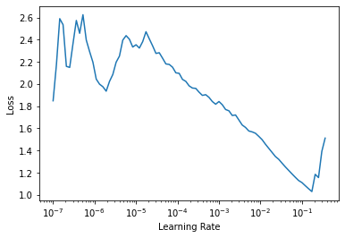

# FAIMED 3D
> use fastai to train fully three-dimensional models on radiological data quickly


## Classification

```python
from faimed3d.all import *
```

Load data in various medical formats (DICOM, NIfTI, NRRD) or even videos as simple as in fastai.

```python
d = pd.read_csv('../data/radiopaedia_cases.csv')
dls = ImageDataLoaders3D.from_df(d,
                                 item_tfms = Resize3D((20, 112, 112)),
                                 batch_tfms = aug_transforms_3d(), 
                                 bs = 2, val_bs = 2)
```

Faimed3d provides multiple pre-trained model architectures for quick transfer learning.   

```python
learn = cnn_learner_3d(dls, efficientnet_b0) 
```

```python
#slow
learn.lr_find()
```


    SuggestedLRs(lr_min=0.017378008365631102, lr_steep=9.12010818865383e-07)





Click [here](../examples/3d_classification.md) for a more in-depth classification example. 

## Segmentation

```python
dls = SegmentationDataLoaders3D.from_df(d,
                                 item_tfms = Resize3D((20, 112, 112)),
                                 batch_tfms = aug_transforms_3d(), 
                                 bs = 2, val_bs = 2)
```

All models in faimed3d can be used as a backbone for U-Nets, even with pre-trained weights. 

```python
learn = unet_learner_3d(dls, efficientnet_b0, n_out = 2) 
```


    ---------------------------------------------------------------------------

    RuntimeError                              Traceback (most recent call last)

    <ipython-input-14-3dbaa2a15c56> in <module>
    ----> 1 learn = unet_learner_3d(dls, efficientnet_b0, n_out = 2)
    

    ~/Documents/faimed3d/nbs/faimed3d/learner.py in unet_learner_3d(dls, arch, normalize, n_out, pretrained, config, loss_func, opt_func, lr, splitter, cbs, metrics, path, model_dir, wd, wd_bn_bias, train_bn, moms, norm_type, **kwargs)
         67     img_size = dls.one_batch()[0].shape[-3:]
         68     assert img_size, "image size could not be inferred from data"
    ---> 69     model = create_unet_model_3d(arch, n_out, img_size, dls.n_inp, pretrained=pretrained, norm_type=norm_type, **kwargs)
         70 
         71     if loss_func is None: loss_func = DiceLoss(smooth=0.)


    ~/Documents/faimed3d/nbs/faimed3d/learner.py in create_unet_model_3d(arch, n_out, img_size, n_inp, pretrained, cut, n_in, **kwargs)
         44     meta = model_meta.get(arch, _default_meta)
         45     body = create_body(arch, n_in, pretrained, ifnone(cut, meta['cut']))
    ---> 46     model = DynamicUnet3D(body, n_out, img_size, n_inp, **kwargs)
         47     return model
         48 


    ~/anaconda3/envs/fastai-v2/lib/python3.8/site-packages/fastcore/meta.py in __call__(cls, *args, **kwargs)
         36         if type(res)==cls:
         37             if hasattr(res,'__pre_init__'): res.__pre_init__(*args,**kwargs)
    ---> 38             res.__init__(*args,**kwargs)
         39             if hasattr(res,'__post_init__'): res.__post_init__(*args,**kwargs)
         40         return res


    ~/Documents/faimed3d/nbs/faimed3d/models/unet.py in __init__(self, encoder, n_out, img_size, n_inp, blur, blur_final, self_attention, y_range, last_cross, bottle, act_cls, init, norm_type, **kwargs)
        115                                      act_cls=act_cls, init=init, norm_type=norm_type, **kwargs).eval()
        116             layers.append(unet_block)
    --> 117             x = unet_block(x)
        118 
        119         ni = x.shape[1]


    ~/anaconda3/envs/fastai-v2/lib/python3.8/site-packages/torch/nn/modules/module.py in _call_impl(self, *input, **kwargs)
        725             result = self._slow_forward(*input, **kwargs)
        726         else:
    --> 727             result = self.forward(*input, **kwargs)
        728         for hook in itertools.chain(
        729                 _global_forward_hooks.values(),


    ~/Documents/faimed3d/nbs/faimed3d/models/unet.py in forward(self, up_in)
         53         if ssh != up_out.shape[-3:]:
         54             up_out = F.interpolate(up_out, s.shape[-3:], mode='nearest')
    ---> 55         cat_x = self.relu(torch.cat([up_out, self.bn(s)], dim=1))
         56         return self.conv2(self.conv1(cat_x))
         57 


    ~/anaconda3/envs/fastai-v2/lib/python3.8/site-packages/torch/nn/modules/module.py in _call_impl(self, *input, **kwargs)
        725             result = self._slow_forward(*input, **kwargs)
        726         else:
    --> 727             result = self.forward(*input, **kwargs)
        728         for hook in itertools.chain(
        729                 _global_forward_hooks.values(),


    ~/anaconda3/envs/fastai-v2/lib/python3.8/site-packages/torch/nn/modules/batchnorm.py in forward(self, input)
        129         used for normalization (i.e. in eval mode when buffers are not None).
        130         """
    --> 131         return F.batch_norm(
        132             input,
        133             # If buffers are not to be tracked, ensure that they won't be updated


    ~/anaconda3/envs/fastai-v2/lib/python3.8/site-packages/torch/nn/functional.py in batch_norm(input, running_mean, running_var, weight, bias, training, momentum, eps)
       2054         _verify_batch_size(input.size())
       2055 
    -> 2056     return torch.batch_norm(
       2057         input, weight, bias, running_mean, running_var,
       2058         training, momentum, eps, torch.backends.cudnn.enabled


    RuntimeError: running_mean should contain 320 elements not 112


```python
#slow
learn.lr_find()
```

Click [here](../examples/3d_segmentation.md) for a more in-depth segmentation example. 
