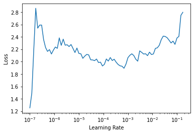

# FAIMED 3D
> fastai extension for medical 3d images including 3d transforms, datablocks and novel network architectures. 


In contrast to fastai which uses Pydicom to read medical images, faimed3d uses SimpleITK, as it supports more image formats.  
Currently, faimed3d is built using the following versions of fastai, fastcore, nbdev, PyTorch, torchvision and SimpleITK

```
import fastai
import pydicom
import torch

print('fastai:', fastai.__version__)
print('pydicom:', pydicom.__version__)
print('torch:', torch.__version__)
print('SimpleITK: 2.0.2rc3 (ITK 5.1)')
```

    fastai: 2.2.5
    pydicom: 2.1.2
    torch: 1.7.0
    SimpleITK: 2.0.2rc3 (ITK 5.1)


## Example 3D classification

```
from faimed3d.all import *
from torchvision.models.video import r3d_18
```

```
d = pd.read_csv('../data/radiopaedia_cases.csv')
```

`faimed3d` keeps track of the metadata until the items are concatenated as a batch. 

```
dls = ImageDataLoaders3D.from_df(d,
                                 item_tfms = ResizeCrop3D(crop_by = (0, 6, 6), 
                                                          resize_to = (20, 112, 112)),
                                 bs = 2, val_bs = 2)
```

Construct a learner similar to fastai, even transfer learning is possible using the pretrained resnet18 from torchvision.

```
learn = cnn_learner_3d(dls, r3d_18) 
```

```
#slow
learn.lr_find()
```


    SuggestedLRs(lr_min=6.918309954926372e-05, lr_steep=1.5848931980144698e-06)




