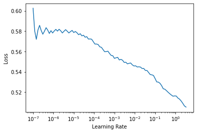

# FAIMED 3D
> fastai extension for medical 3d images including 3d transforms, datablocks and novel network architectures. 


## Install

`pip install faimed3d`

In contrast to fastai, which uses Pydicom to read medical images, faimed3d uses SimpleITK, as it supports more image formats.  
Currently faimed3d is build using the following versions of fastai, fastcore, nbdev, PyTorch, torchvision and SimpleITK

```
import fastai
import fastcore
import nbdev
import torch
import torchvision

print('fastai:', fastai.__version__)
print('fastcore:', fastcore.__version__)
print('nbdev:', nbdev.__version__)
print('torch:', torch.__version__)
print('torchvision:', torchvision.__version__)
print('SimpleITK: 2.0.0rc3 (ITK 5.1)')
```

    fastai: 2.1.10
    fastcore: 1.3.16
    nbdev: 1.1.4
    torch: 1.7.0
    torchvision: 0.8.1
    SimpleITK: 2.0.0rc3 (ITK 5.1)


## Example 3D classification on the MRNet Dataset

```
from faimed3d.all import *
from torchvision.models.video import r3d_18
```

```
d = pd.read_csv('../data/radiopaedia_cases.csv')
```

Defining paramteres for piecewise histogram scaling. Paramters can be obtained from dataloaders running `dls.standard_scale_from_dls()`

`faimed3d` keeps track of the metadata until the items are concatenated as a batch. 

```
dls = ImageDataLoaders3D.from_df(d,
                                 item_tfms = ResizeCrop3D(crop_by = (0., 0.1, 0.1), resize_to = (20, 112, 112), perc_crop = True),
                                 bs = 2, val_bs = 2)
```

Construct a learner similar to fastai, even transfer learning is possible using the pretrained resnet18 from torchvision.

```
learn = cnn_learner_3d(dls, r3d_18, pretrained=False) 
learn = learn.to_fp16()
```

```
#slow
learn.lr_find()
```


    SuggestedLRs(lr_min=0.00043651582673192023, lr_steep=1.3182567499825382e-06)




