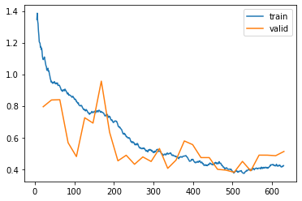
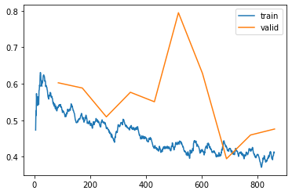
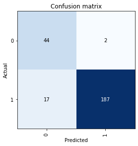

# Example - Train a 3d Classifier in Stanford MR-NET Dataset
> end-to-end example on how to train a fully 3D resnet on MRI images with `faimed3d`


```python
from faimed3d.all import *
from torchvision.models.video import r3d_18
from fastai.distributed import *
from fastai.callback.all import SaveModelCallback
```

The Stanford MR-NET dataset is a collection of 1,370, performed at Stanford University Medical Center. Each examinations consists out of three different sequences. In this example the sagittal TIRM is used, as it is the best sequence to detect bone edma, a sensitive sign of a global abnormality.   
The dataset can be downloaded at https://stanfordmlgroup.github.io/competitions/mrnet/. Please check out their [paper](https://stanfordmlgroup.github.io/competitions/mrnet/) for more information on  the dataset and the MR-NET. 

```python
NBS_DIR = Path(os.getcwd())
DATA_DIR = NBS_DIR.parent/'data'
MODEL_DIR = NBS_DIR.parent/'models'
```

```python
d = pd.read_csv(DATA_DIR/'train_knee.csv') # data not available in this repository.
d['file_names'] = [fn.replace('coronal', 'sagittal') for fn in d.file_names]
d.columns
```


    Index(['file_names', 'abnormal', 'is_valid'], dtype='object')


In the dataframe, the first column is the absolute path to the image file and the second column is the label. Also there is a strong imbalance towards pathological images, so the normal images will be oversampled. To avoid having the same images in train and validation dataset, due to oversampling, an index is used for the validation dataset. 

```python
d_oversampled = pd.concat((d, d[d.abnormal == 0], d[d.abnormal == 0]))
```

## Baseline at 112 px
A progressive resizing approach will be used to classify the sagittal images. For this images are first resized to 20 x 112 x 112 px, which allows the use of a large batch size. The training is performed in parallel on two Nvidia RTX 2080ti with 11GB of VRAM each, but would also be possible on a single GPU.  

```python
dls = ImageDataLoaders3D.from_df(d_oversampled, path = '/',
                                splitter = ColSplitter('is_valid'),
                                item_tfms = ResizeCrop3D(crop_by = (0, 0, 0), # don't crop the images
                                                         resize_to = (20, 112, 112)), 
                                batch_tfms = aug_transforms_3d(p_all = 0.2), # all tfms with p = 0.2 for each tfms to get called
                                bs = 64, val_bs = 64)
```

In a more serious approach, one would utilize some callbacks as the `SaveModelCallback`, `GradientClipping`, maybe use `CrossEntropyLabelSmoothing` as loss function and clearly define train and validation set with an index, to not acidentially mix up the two datasets. It is not done in this notebook to keep it simple. 

```python
learn = cnn_learner_3d(dls, r3d_18, metrics = [accuracy, RocAucBinary()], 
                       cbs = SaveModelCallback(monitor='accuracy'), model_dir = MODEL_DIR)
learn.to_fp16()
learn = learn.to_parallel()
```

```python
learn.fine_tune(30, freeze_epochs = 1, wd = 1e-4)
```


<table border="1" class="dataframe">
  <thead>
    <tr style="text-align: left;">
      <th>epoch</th>
      <th>train_loss</th>
      <th>valid_loss</th>
      <th>accuracy</th>
      <th>roc_auc_score</th>
      <th>time</th>
    </tr>
  </thead>
  <tbody>
    <tr>
      <td>0</td>
      <td>1.344143</td>
      <td>7.139972</td>
      <td>0.395954</td>
      <td>0.543551</td>
      <td>00:30</td>
    </tr>
  </tbody>
</table>


    Better model found at epoch 0 with accuracy value: 0.3959537446498871.


<table border="1" class="dataframe">
  <thead>
    <tr style="text-align: left;">
      <th>epoch</th>
      <th>train_loss</th>
      <th>valid_loss</th>
      <th>accuracy</th>
      <th>roc_auc_score</th>
      <th>time</th>
    </tr>
  </thead>
  <tbody>
    <tr>
      <td>0</td>
      <td>1.099595</td>
      <td>0.794597</td>
      <td>0.647399</td>
      <td>0.701516</td>
      <td>00:32</td>
    </tr>
    <tr>
      <td>1</td>
      <td>0.950920</td>
      <td>0.837331</td>
      <td>0.679191</td>
      <td>0.798607</td>
      <td>00:31</td>
    </tr>
    <tr>
      <td>2</td>
      <td>0.930535</td>
      <td>0.839099</td>
      <td>0.684971</td>
      <td>0.809049</td>
      <td>00:32</td>
    </tr>
    <tr>
      <td>3</td>
      <td>0.877060</td>
      <td>0.566988</td>
      <td>0.754335</td>
      <td>0.842821</td>
      <td>00:32</td>
    </tr>
    <tr>
      <td>4</td>
      <td>0.834508</td>
      <td>0.479512</td>
      <td>0.777457</td>
      <td>0.860039</td>
      <td>00:31</td>
    </tr>
    <tr>
      <td>5</td>
      <td>0.779111</td>
      <td>0.725158</td>
      <td>0.702312</td>
      <td>0.883037</td>
      <td>00:32</td>
    </tr>
    <tr>
      <td>6</td>
      <td>0.758589</td>
      <td>0.691208</td>
      <td>0.734104</td>
      <td>0.842699</td>
      <td>00:33</td>
    </tr>
    <tr>
      <td>7</td>
      <td>0.765461</td>
      <td>0.956451</td>
      <td>0.644509</td>
      <td>0.810795</td>
      <td>00:33</td>
    </tr>
    <tr>
      <td>8</td>
      <td>0.734858</td>
      <td>0.632678</td>
      <td>0.705202</td>
      <td>0.857856</td>
      <td>00:32</td>
    </tr>
    <tr>
      <td>9</td>
      <td>0.687992</td>
      <td>0.452573</td>
      <td>0.791907</td>
      <td>0.880453</td>
      <td>00:32</td>
    </tr>
    <tr>
      <td>10</td>
      <td>0.612130</td>
      <td>0.487902</td>
      <td>0.794798</td>
      <td>0.895697</td>
      <td>00:33</td>
    </tr>
    <tr>
      <td>11</td>
      <td>0.565593</td>
      <td>0.430797</td>
      <td>0.835260</td>
      <td>0.920756</td>
      <td>00:33</td>
    </tr>
    <tr>
      <td>12</td>
      <td>0.529080</td>
      <td>0.477395</td>
      <td>0.806358</td>
      <td>0.905773</td>
      <td>00:32</td>
    </tr>
    <tr>
      <td>13</td>
      <td>0.519458</td>
      <td>0.448552</td>
      <td>0.780347</td>
      <td>0.880662</td>
      <td>00:33</td>
    </tr>
    <tr>
      <td>14</td>
      <td>0.513008</td>
      <td>0.530449</td>
      <td>0.780347</td>
      <td>0.907607</td>
      <td>00:32</td>
    </tr>
    <tr>
      <td>15</td>
      <td>0.500788</td>
      <td>0.404986</td>
      <td>0.841040</td>
      <td>0.916285</td>
      <td>00:33</td>
    </tr>
    <tr>
      <td>16</td>
      <td>0.481881</td>
      <td>0.457320</td>
      <td>0.841040</td>
      <td>0.924755</td>
      <td>00:33</td>
    </tr>
    <tr>
      <td>17</td>
      <td>0.482219</td>
      <td>0.578239</td>
      <td>0.725434</td>
      <td>0.860161</td>
      <td>00:33</td>
    </tr>
    <tr>
      <td>18</td>
      <td>0.458752</td>
      <td>0.555119</td>
      <td>0.765896</td>
      <td>0.903590</td>
      <td>00:33</td>
    </tr>
    <tr>
      <td>19</td>
      <td>0.442184</td>
      <td>0.473160</td>
      <td>0.797688</td>
      <td>0.902909</td>
      <td>00:34</td>
    </tr>
    <tr>
      <td>20</td>
      <td>0.427631</td>
      <td>0.473112</td>
      <td>0.794798</td>
      <td>0.924772</td>
      <td>00:34</td>
    </tr>
    <tr>
      <td>21</td>
      <td>0.436852</td>
      <td>0.398998</td>
      <td>0.843931</td>
      <td>0.932246</td>
      <td>00:32</td>
    </tr>
    <tr>
      <td>22</td>
      <td>0.404188</td>
      <td>0.393856</td>
      <td>0.843931</td>
      <td>0.930482</td>
      <td>00:33</td>
    </tr>
    <tr>
      <td>23</td>
      <td>0.375834</td>
      <td>0.380219</td>
      <td>0.838150</td>
      <td>0.927566</td>
      <td>00:32</td>
    </tr>
    <tr>
      <td>24</td>
      <td>0.380004</td>
      <td>0.449176</td>
      <td>0.835260</td>
      <td>0.919376</td>
      <td>00:33</td>
    </tr>
    <tr>
      <td>25</td>
      <td>0.394911</td>
      <td>0.389391</td>
      <td>0.852601</td>
      <td>0.940820</td>
      <td>00:34</td>
    </tr>
    <tr>
      <td>26</td>
      <td>0.406509</td>
      <td>0.488678</td>
      <td>0.809249</td>
      <td>0.934446</td>
      <td>00:33</td>
    </tr>
    <tr>
      <td>27</td>
      <td>0.411663</td>
      <td>0.488464</td>
      <td>0.794798</td>
      <td>0.922694</td>
      <td>00:35</td>
    </tr>
    <tr>
      <td>28</td>
      <td>0.419972</td>
      <td>0.485111</td>
      <td>0.817919</td>
      <td>0.929138</td>
      <td>00:35</td>
    </tr>
    <tr>
      <td>29</td>
      <td>0.422603</td>
      <td>0.511886</td>
      <td>0.797688</td>
      <td>0.906227</td>
      <td>00:34</td>
    </tr>
  </tbody>
</table>


    Better model found at epoch 0 with accuracy value: 0.647398829460144.
    Better model found at epoch 1 with accuracy value: 0.6791907548904419.
    Better model found at epoch 2 with accuracy value: 0.6849710941314697.
    Better model found at epoch 3 with accuracy value: 0.7543352842330933.
    Better model found at epoch 4 with accuracy value: 0.7774566411972046.
    Better model found at epoch 9 with accuracy value: 0.7919074892997742.
    Better model found at epoch 10 with accuracy value: 0.7947976589202881.
    Better model found at epoch 11 with accuracy value: 0.8352600932121277.
    Better model found at epoch 15 with accuracy value: 0.8410404920578003.
    Better model found at epoch 21 with accuracy value: 0.8439306616783142.
    Better model found at epoch 25 with accuracy value: 0.852601170539856.


```python
learn.recorder.plot_loss()
```





## Resizing
Changes in MRI are often subtle and may disappear in aggresive downsampling of images. In a next step the image resolution is increased and the model ist trained some more. 

```python
dls = ImageDataLoaders3D.from_df(d_oversampled, path = '/',
                                splitter = RandomSplitter(seed = 42),
                                item_tfms = ResizeCrop3D(crop_by = (0, 0, 0), # don't crop the images
                                                         resize_to = (20, 224, 224)), 
                                batch_tfms = aug_transforms_3d(p_all = 0.15), 
                                bs = 16, val_bs = 16)
```

```python
learn = cnn_learner_3d(dls, r3d_18, metrics = [accuracy, RocAucBinary()], 
                       cbs = SaveModelCallback(monitor='accuracy'), model_dir = MODEL_DIR)
learn.to_fp16()
learn = learn.load('model')
learn = learn.to_parallel()
```


```python
learn.fine_tune(10, freeze_epochs = 1, wd = 1e-4)
```


<table border="1" class="dataframe">
  <thead>
    <tr style="text-align: left;">
      <th>epoch</th>
      <th>train_loss</th>
      <th>valid_loss</th>
      <th>accuracy</th>
      <th>roc_auc_score</th>
      <th>time</th>
    </tr>
  </thead>
  <tbody>
    <tr>
      <td>0</td>
      <td>0.620913</td>
      <td>1.198181</td>
      <td>0.543353</td>
      <td>0.806269</td>
      <td>01:39</td>
    </tr>
  </tbody>
</table>


    Better model found at epoch 0 with accuracy value: 0.5433526039123535.


<table border="1" class="dataframe">
  <thead>
    <tr style="text-align: left;">
      <th>epoch</th>
      <th>train_loss</th>
      <th>valid_loss</th>
      <th>accuracy</th>
      <th>roc_auc_score</th>
      <th>time</th>
    </tr>
  </thead>
  <tbody>
    <tr>
      <td>0</td>
      <td>0.537233</td>
      <td>0.602706</td>
      <td>0.734104</td>
      <td>0.856645</td>
      <td>02:23</td>
    </tr>
    <tr>
      <td>1</td>
      <td>0.510992</td>
      <td>0.588361</td>
      <td>0.742775</td>
      <td>0.870363</td>
      <td>02:21</td>
    </tr>
    <tr>
      <td>2</td>
      <td>0.482025</td>
      <td>0.509262</td>
      <td>0.783237</td>
      <td>0.893975</td>
      <td>02:26</td>
    </tr>
    <tr>
      <td>3</td>
      <td>0.482205</td>
      <td>0.576721</td>
      <td>0.754335</td>
      <td>0.887249</td>
      <td>02:19</td>
    </tr>
    <tr>
      <td>4</td>
      <td>0.422891</td>
      <td>0.550677</td>
      <td>0.760116</td>
      <td>0.908524</td>
      <td>02:21</td>
    </tr>
    <tr>
      <td>5</td>
      <td>0.439781</td>
      <td>0.794941</td>
      <td>0.693642</td>
      <td>0.904984</td>
      <td>02:20</td>
    </tr>
    <tr>
      <td>6</td>
      <td>0.418022</td>
      <td>0.628537</td>
      <td>0.768786</td>
      <td>0.903533</td>
      <td>02:19</td>
    </tr>
    <tr>
      <td>7</td>
      <td>0.427365</td>
      <td>0.394326</td>
      <td>0.852601</td>
      <td>0.921871</td>
      <td>02:18</td>
    </tr>
    <tr>
      <td>8</td>
      <td>0.419326</td>
      <td>0.459509</td>
      <td>0.806358</td>
      <td>0.916879</td>
      <td>02:22</td>
    </tr>
    <tr>
      <td>9</td>
      <td>0.410638</td>
      <td>0.475910</td>
      <td>0.791907</td>
      <td>0.920083</td>
      <td>02:19</td>
    </tr>
  </tbody>
</table>


    Better model found at epoch 0 with accuracy value: 0.7341040372848511.
    Better model found at epoch 1 with accuracy value: 0.7427745461463928.
    Better model found at epoch 2 with accuracy value: 0.7832369804382324.
    Better model found at epoch 7 with accuracy value: 0.852601170539856.


```python
learn.recorder.plot_loss()
```





## Interpretation

For interpretation, the dataloader is build again and this time the original, not oversampled data is used, as AUC and sensitivity are influenced by the prevalence. 

```python
dls = ImageDataLoaders3D.from_df(d, path = '/', 
                                splitter = RandomSplitter(seed = 42),
                                item_tfms = ResizeCrop3D(crop_by = (0, 0, 0), # don't crop the images
                                                         resize_to = (20, 224, 224)), 
                                batch_tfms = aug_transforms_3d(p_all = 0.15), 
                                bs = 16, val_bs = 16)
```

```python
learn = cnn_learner_3d(dls, r3d_18, metrics = [accuracy, RocAucBinary()], cbs = SaveModelCallback(), model_dir = MODEL_DIR)
learn.to_fp16()
```

```python
learn = learn.load('model')
```

```python
interp = ClassificationInterpretation.from_learner(learn)
```


```python
interp.plot_confusion_matrix()
```





```python
interp.print_classification_report()
```

                  precision    recall  f1-score   support
    
               0       0.72      0.96      0.82        46
               1       0.99      0.92      0.95       204
    
        accuracy                           0.92       250
       macro avg       0.86      0.94      0.89       250
    weighted avg       0.94      0.92      0.93       250
    


These results are pretty close to the published state of the art with an accuracy of 0.92 vs. 0.85 by the Stanford group and recall of 0.92 for detecting global abnormalities (vs. 0.879 for the Stanford group, see Table 2 of their [publication](https://journals.plos.org/plosmedicine/article?id=10.1371/journal.pmed.1002699)). Although in this example only one of three sequences was used and the metrics are calculated on the validation dataset, not on the hidden test dataset of the Stanford MR-NET challenge. 
