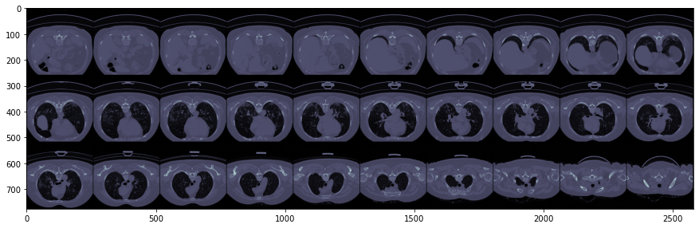
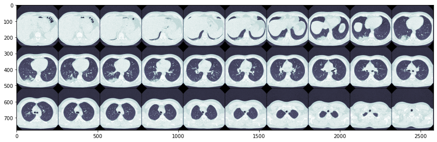
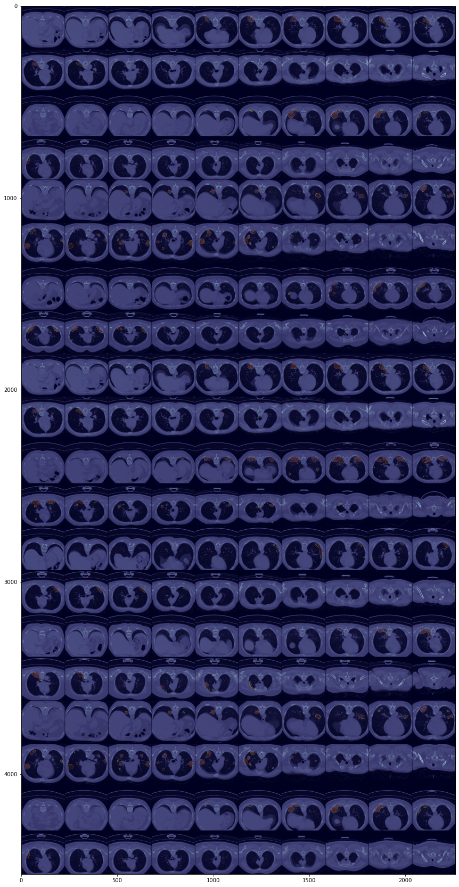
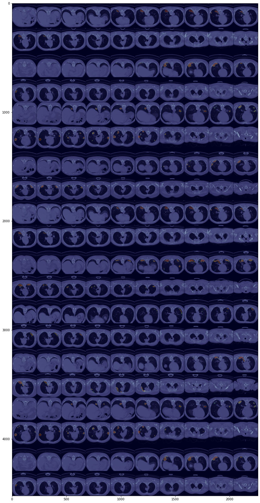

# Example - Train a 3d U-Net for Segmentation of Pulmonary Infiltrates Associated with COVID-19
> end-to-end example on how to use `faimed3d` to train a fully 3D U-Net with a pretrained encoder 


```python
from faimed3d.all import *
from torchvision.models.video import r3d_18
from fastai.callback.all import SaveModelCallback
from torch import nn
```

```python
REPO_DIR = Path(os.getcwd()).parent
DATA_DIR = Path('/media/ScaleOut/vahldiek/CT/1_Covid-19-CT-Seg')
```

```python
ct_images = (DATA_DIR/'coronacases').ls()
ct_images.sort()
infect_mask = (DATA_DIR/'infection_mask').ls()
infect_mask.sort()
```

```python
d = pd.DataFrame({'images': ct_images, 
                 'masks': infect_mask})
```

```python
TensorDicom3D.create(d.images[0]).show()
```





```python
TensorDicom3D.create(d.images[11]).show()
```





The radiopeadia images have already been windowed, which will make it difficult for the model to generalize, so they are excluded.  
Training on only six images, makes the epoch very short. As at the beginning of each epoch PyTorch and fastai need some time to prepare the dataloaders and model (e.g. switch to/from evaluation mode), artificially increasing the data through oversampling can speed up the overall training process. 

```python
d = d[:10] # exclude all radiopaedia cases
d['is_valid'] = [1,1,1,1,0,0,0,0,0,0]
d_oversampled = pd.concat((d, )*5) # oversample
```

Six images will be used for training and five for validation, so the data augmentations are increased. 

```python
dls = SegmentationDataLoaders3D.from_df(d_oversampled, path = '/',
                                item_tfms = ResizeCrop3D((0, 0, 0), (20, 224, 224)), 
                                batch_tfms = [RandomPerspective3D(224, 0.5), 
                                              *aug_transforms_3d(p_all=0.15, noise=False)],
                                bs = 1, 
                                val_bs = 1,
                                splitter = ColSplitter('is_valid'))
```

Combining `dice_loss` and `CrossEntropyLoss` can be a helpful technique to get faster convergence.  

```python
def dice(input, target):
    iflat = input.contiguous().view(-1)
    tflat = target.contiguous().view(-1)
    intersection = (iflat * tflat).sum()
    return ((2. * intersection) /
           (iflat.sum() + tflat.sum()))

def dice_score(input, target):
    return dice(input.argmax(1), target)

def dice_loss(input, target): 
    return 1 - dice(input.softmax(1)[:, 1], target)

def loss(input, target):
    return dice_loss(input, target) + nn.CrossEntropyLoss()(input, target[:, 0])
```

```python
learn = unet_learner_3d(dls, r3d_18, n_out=2, 
                        loss_func = loss,
                        metrics = dice_score,
                        model_dir = REPO_DIR/'models',
                        cbs = [SaveModelCallback(monitor='dice_score')]
                       )
learn = learn.to_fp16()
```

```python
learn.lr_find()
```


    
    SuggestedLRs(lr_min=0.05248074531555176, lr_steep=0.43651583790779114)


The suggested learning rates by the `lr_finder` are usually to high, leading to exploding gradients. It is better to divide the suggested LR by 10 or 100. Still, training at the beginning is often unstable, but will become more stable with more epochs. `nan` for validation loss in early epochs, is not necessarily a reason to stop the training.  

```python
learn.fit_one_cycle(3, 0.01, wd = 1e-4)
```


<table border="1" class="dataframe">
  <thead>
    <tr style="text-align: left;">
      <th>epoch</th>
      <th>train_loss</th>
      <th>valid_loss</th>
      <th>dice_score</th>
      <th>time</th>
    </tr>
  </thead>
  <tbody>
    <tr>
      <td>0</td>
      <td>1.617970</td>
      <td>7.553207</td>
      <td>0.022217</td>
      <td>01:23</td>
    </tr>
    <tr>
      <td>1</td>
      <td>1.447020</td>
      <td>1.348669</td>
      <td>0.030857</td>
      <td>01:14</td>
    </tr>
    <tr>
      <td>2</td>
      <td>1.348788</td>
      <td>1.290999</td>
      <td>0.219593</td>
      <td>01:14</td>
    </tr>
  </tbody>
</table>


    Better model found at epoch 0 with dice_score value: 0.022217031568288803.
    Better model found at epoch 1 with dice_score value: 0.03085685335099697.
    Better model found at epoch 2 with dice_score value: 0.21959252655506134.
  

```python
learn.unfreeze()
learn.fit_one_cycle(50, 1e-3, wd = 1e-4)
```


<table border="1" class="dataframe">
  <thead>
    <tr style="text-align: left;">
      <th>epoch</th>
      <th>train_loss</th>
      <th>valid_loss</th>
      <th>dice_score</th>
      <th>time</th>
    </tr>
  </thead>
  <tbody>
    <tr>
      <td>0</td>
      <td>1.277849</td>
      <td>1.300274</td>
      <td>0.169884</td>
      <td>01:16</td>
    </tr>
    <tr>
      <td>1</td>
      <td>1.271986</td>
      <td>1.285651</td>
      <td>0.259191</td>
      <td>01:18</td>
    </tr>
    <tr>
      <td>2</td>
      <td>1.267972</td>
      <td>1.266772</td>
      <td>0.394450</td>
      <td>01:19</td>
    </tr>
    <tr>
      <td>3</td>
      <td>1.262012</td>
      <td>1.279280</td>
      <td>0.284623</td>
      <td>01:18</td>
    </tr>
    <tr>
      <td>4</td>
      <td>1.256839</td>
      <td>1.258349</td>
      <td>0.492355</td>
      <td>01:18</td>
    </tr>
    <tr>
      <td>5</td>
      <td>1.254410</td>
      <td>1.248541</td>
      <td>0.528375</td>
      <td>01:19</td>
    </tr>
    <tr>
      <td>6</td>
      <td>1.243158</td>
      <td>1.260393</td>
      <td>0.261894</td>
      <td>01:19</td>
    </tr>
    <tr>
      <td>7</td>
      <td>1.233036</td>
      <td>nan</td>
      <td>0.048495</td>
      <td>01:18</td>
    </tr>
    <tr>
      <td>8</td>
      <td>1.219665</td>
      <td>1.205178</td>
      <td>0.570096</td>
      <td>01:18</td>
    </tr>
    <tr>
      <td>9</td>
      <td>1.206917</td>
      <td>1.301556</td>
      <td>0.091743</td>
      <td>01:19</td>
    </tr>
    <tr>
      <td>10</td>
      <td>1.186561</td>
      <td>1.181180</td>
      <td>0.487740</td>
      <td>01:18</td>
    </tr>
    <tr>
      <td>11</td>
      <td>1.169439</td>
      <td>1.216021</td>
      <td>0.182845</td>
      <td>01:18</td>
    </tr>
    <tr>
      <td>12</td>
      <td>1.157408</td>
      <td>1.165419</td>
      <td>0.395111</td>
      <td>01:18</td>
    </tr>
    <tr>
      <td>13</td>
      <td>1.139597</td>
      <td>1.136980</td>
      <td>0.524025</td>
      <td>01:18</td>
    </tr>
    <tr>
      <td>14</td>
      <td>1.124535</td>
      <td>1.131342</td>
      <td>0.527730</td>
      <td>01:18</td>
    </tr>
    <tr>
      <td>15</td>
      <td>1.104634</td>
      <td>1.211899</td>
      <td>0.111883</td>
      <td>01:19</td>
    </tr>
    <tr>
      <td>16</td>
      <td>1.097506</td>
      <td>1.103193</td>
      <td>0.568950</td>
      <td>01:18</td>
    </tr>
    <tr>
      <td>17</td>
      <td>1.084650</td>
      <td>1.088717</td>
      <td>0.610375</td>
      <td>01:19</td>
    </tr>
    <tr>
      <td>18</td>
      <td>1.067548</td>
      <td>1.070056</td>
      <td>0.628555</td>
      <td>01:18</td>
    </tr>
    <tr>
      <td>19</td>
      <td>1.048581</td>
      <td>1.083311</td>
      <td>0.375368</td>
      <td>01:18</td>
    </tr>
    <tr>
      <td>20</td>
      <td>1.038405</td>
      <td>1.056531</td>
      <td>0.538761</td>
      <td>01:19</td>
    </tr>
    <tr>
      <td>21</td>
      <td>1.032926</td>
      <td>1.091693</td>
      <td>0.297455</td>
      <td>01:18</td>
    </tr>
    <tr>
      <td>22</td>
      <td>1.027478</td>
      <td>1.053580</td>
      <td>0.492599</td>
      <td>01:19</td>
    </tr>
    <tr>
      <td>23</td>
      <td>1.012300</td>
      <td>1.017731</td>
      <td>0.667421</td>
      <td>01:18</td>
    </tr>
    <tr>
      <td>24</td>
      <td>0.999201</td>
      <td>1.014029</td>
      <td>0.657778</td>
      <td>01:19</td>
    </tr>
    <tr>
      <td>25</td>
      <td>0.984335</td>
      <td>1.012218</td>
      <td>0.536109</td>
      <td>01:18</td>
    </tr>
    <tr>
      <td>26</td>
      <td>0.978572</td>
      <td>1.037715</td>
      <td>0.311021</td>
      <td>01:19</td>
    </tr>
    <tr>
      <td>27</td>
      <td>0.972869</td>
      <td>1.004563</td>
      <td>0.572911</td>
      <td>01:19</td>
    </tr>
    <tr>
      <td>28</td>
      <td>0.962912</td>
      <td>0.985065</td>
      <td>0.598763</td>
      <td>01:19</td>
    </tr>
    <tr>
      <td>29</td>
      <td>0.957247</td>
      <td>0.983570</td>
      <td>0.642466</td>
      <td>01:19</td>
    </tr>
    <tr>
      <td>30</td>
      <td>0.946731</td>
      <td>0.974621</td>
      <td>0.605570</td>
      <td>01:18</td>
    </tr>
    <tr>
      <td>31</td>
      <td>0.944053</td>
      <td>0.999155</td>
      <td>0.416248</td>
      <td>01:19</td>
    </tr>
    <tr>
      <td>32</td>
      <td>0.936624</td>
      <td>0.969453</td>
      <td>0.601356</td>
      <td>01:19</td>
    </tr>
    <tr>
      <td>33</td>
      <td>0.931428</td>
      <td>0.954822</td>
      <td>0.649087</td>
      <td>01:19</td>
    </tr>
    <tr>
      <td>34</td>
      <td>0.916852</td>
      <td>0.948883</td>
      <td>0.629919</td>
      <td>01:19</td>
    </tr>
    <tr>
      <td>35</td>
      <td>0.907974</td>
      <td>0.943074</td>
      <td>0.655565</td>
      <td>01:19</td>
    </tr>
    <tr>
      <td>36</td>
      <td>0.904585</td>
      <td>0.958528</td>
      <td>0.564986</td>
      <td>01:19</td>
    </tr>
    <tr>
      <td>37</td>
      <td>0.903870</td>
      <td>0.953206</td>
      <td>0.572820</td>
      <td>01:18</td>
    </tr>
    <tr>
      <td>38</td>
      <td>0.896562</td>
      <td>0.934182</td>
      <td>0.703282</td>
      <td>01:19</td>
    </tr>
    <tr>
      <td>39</td>
      <td>0.894336</td>
      <td>0.929551</td>
      <td>0.690418</td>
      <td>01:19</td>
    </tr>
    <tr>
      <td>40</td>
      <td>0.885841</td>
      <td>0.932464</td>
      <td>0.677648</td>
      <td>01:19</td>
    </tr>
    <tr>
      <td>41</td>
      <td>0.893995</td>
      <td>0.955278</td>
      <td>0.528160</td>
      <td>01:19</td>
    </tr>
    <tr>
      <td>42</td>
      <td>0.887511</td>
      <td>0.928274</td>
      <td>0.674235</td>
      <td>01:19</td>
    </tr>
    <tr>
      <td>43</td>
      <td>0.882461</td>
      <td>0.924388</td>
      <td>0.697535</td>
      <td>01:19</td>
    </tr>
    <tr>
      <td>44</td>
      <td>0.882864</td>
      <td>0.928446</td>
      <td>0.689763</td>
      <td>01:19</td>
    </tr>
    <tr>
      <td>45</td>
      <td>0.880625</td>
      <td>0.922291</td>
      <td>0.720408</td>
      <td>01:19</td>
    </tr>
    <tr>
      <td>46</td>
      <td>0.885734</td>
      <td>0.925096</td>
      <td>0.712881</td>
      <td>01:19</td>
    </tr>
    <tr>
      <td>47</td>
      <td>0.878734</td>
      <td>0.919903</td>
      <td>0.715904</td>
      <td>01:18</td>
    </tr>
    <tr>
      <td>48</td>
      <td>0.879444</td>
      <td>0.932021</td>
      <td>0.633199</td>
      <td>01:19</td>
    </tr>
    <tr>
      <td>49</td>
      <td>0.873842</td>
      <td>0.916253</td>
      <td>0.736103</td>
      <td>01:18</td>
    </tr>
  </tbody>
</table>


    Better model found at epoch 0 with dice_score value: 0.16988438367843628.
    Better model found at epoch 1 with dice_score value: 0.25919052958488464.
    Better model found at epoch 2 with dice_score value: 0.39445048570632935.
    Better model found at epoch 4 with dice_score value: 0.49235478043556213.
    Better model found at epoch 5 with dice_score value: 0.5283752679824829.
    Better model found at epoch 8 with dice_score value: 0.5700957775115967.
    Better model found at epoch 17 with dice_score value: 0.6103752851486206.
    Better model found at epoch 18 with dice_score value: 0.6285550594329834.
    Better model found at epoch 23 with dice_score value: 0.6674210429191589.
    Better model found at epoch 38 with dice_score value: 0.7032817602157593.
    Better model found at epoch 45 with dice_score value: 0.7204076647758484.
    Better model found at epoch 49 with dice_score value: 0.736102819442749.


## Evaluation

Evalutation is done only on the original data.

```python
dls = SegmentationDataLoaders3D.from_df(d, path = '/',
                                item_tfms = ResizeCrop3D((0, 0, 0), (20, 224, 224)), 
                                batch_tfms = [RandomPerspective3D(224, 0.5), 
                                              *aug_transforms_3d(p_all=0.5)],
                                bs = 1, 
                                val_bs = 1,
                                splitter = ColSplitter('is_valid'))
```

```python
learn = learn.load('model')
inp, pred, target = learn.get_preds(with_input = True)
```

    


```python
inp.show(nrow=10, figsize = (30, 30))
pred.argmax(1).show(nrow=10, add_to_existing = True, alpha = 0.25, cmap = 'jet')
```





```python
inp.show(nrow=10, figsize = (30, 30))
target.show(nrow=10, add_to_existing = True, alpha = 0.25, cmap = 'jet')
```





```python
dice_score(pred, target)
```


    TensorMask3D(0.7255)


A micro averaged dice score of 0.726 is similar to the macro averaged dice score of 0.673 as reported by Ma et al. although, micro averaged scores tend to be slightly higher and Ma et al. only used four CT examinations instead of six to train the segmentation model. Still this is close to the published state of the art. 
